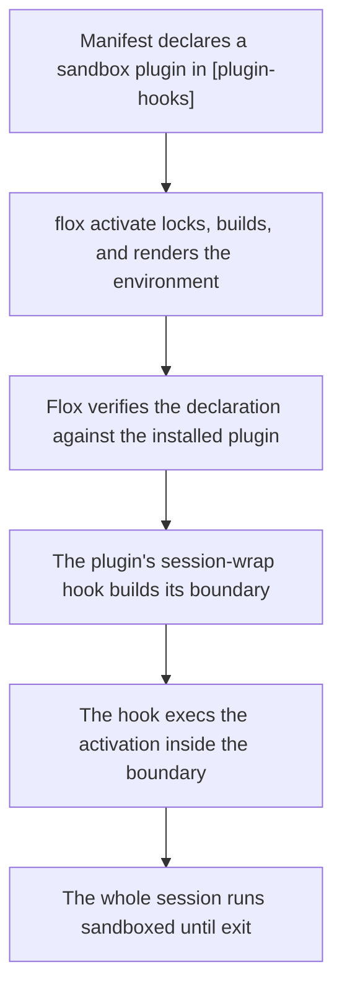

A growing share of what runs inside a developer environment isn't typed
by a developer: coding agents, build tools, and scripts pulled from the
ecosystem all execute with your full privileges. By default an activated
environment can read `~/.ssh`, your browser profiles, and your cloud
credentials, and can talk to any host on the network.

**Sandboxing** runs the activated session inside a boundary that limits
what it can touch. In Flox, sandboxing is not a CLI feature — it is a
family of [plugins](/concepts/plugins) built on the plugin framework's
[lifecycle hooks](/concepts/plugins#lifecycle-hooks). Flox core provides
generic extension points (wrap the session, inject variables, run a
supervised daemon); each sandbox backend is an ordinary installable
package that uses them. The same pattern as
[secrets management](/concepts/secrets-management) — a class of problem
solved by a class of plugin — applied to isolation.

<Warning>
  Sandbox plugins are a **prototype**. They require a development build
  of Flox with lifecycle-hook support, a manifest `schema-version` of
  `"1.16.0"`, and the `features.plugin_hooks` flag enabled
  (`flox config --set features.plugin_hooks true`), and the
  plugin packages are not yet published to the Flox Catalog — they are
  built from the [flox-plugins](https://github.com/flox/flox-plugins)
  repository and installed by store path. Expect the details below to
  change.
</Warning>

## The sandboxed activation pattern



The pattern has three phases:

### 1. Declare (in the manifest)

The environment's author installs a sandbox plugin (by store path,
while the packages are unpublished — see the warning above) and
declares it in the typed, top-level `[plugin-hooks]` section, with any
policy the plugin supports in its own `[plugins.<name>]` table:

```toml
[plugin-hooks]
session-wrap = "plugin-openshell"

[[plugins.plugin-openshell.network]]
endpoint = "api.github.com:443"
access = "read-only"
binary = "curl"
```

The manifest carries the *policy* — which plugin wraps the session, what
the session may reach — versioned with the project like any other
manifest content. Policy edits take effect on the next activation.

### 2. Consent (at activation)

Handing a terminal session to third-party code is gated on the
environment's own author and on the person activating:

- Only the top-level manifest's `[plugin-hooks]` declaration counts — a
  declaration arriving through [composition](/concepts/composition) is
  dropped, so an included environment can never wrap your session.
- [Auto-activation](/concepts/auto-activation) prompts before entering a
  wrapping environment, defaulting to No.
- With the feature flag off, declarations are ignored with a warning and
  activation proceeds unwrapped — teammates who haven't opted in aren't
  locked out of a shared environment.

### 3. Enforce (for the session's lifetime)

For a session-boundary plugin, the hook execs the entire activation
under its boundary and never returns: there is no "decline the sandbox
and continue unwrapped" path. Every process in the session — your
shell, its children, anything an agent spawns — lives inside the
boundary until the session exits.

Not every sandbox plugin completes phase 3 the same way:
[advisory mediation](#advisory-mediation-libsandbox) replaces the
boundary with per-access mediation armed through the `env` and
`sidecar` hooks, and the [hand-off plugins](#hand-off-sandboxes) stop
after compiling policy and generating launch artifacts, leaving the
launch — and with it the enforcement — to an operator on the vendor's
platform.

## Key security properties

- **Policy in the manifest, values nowhere** — the manifest declares
  *what may be reached*, reviewable in a PR like any other change
- **Consent is structural** — declarations are typed, top-level, and
  never inherited through includes; auto-activation asks first and
  defaults to No
- **One wrapper per environment** — the schema makes a second
  `session-wrap` declaration unrepresentable
- **Declaration is bound to the package** — the hook file must be
  shipped by the declared plugin's own locked package; a look-alike
  package shadowing a plugin's name is an activation error
- **Fail closed** — a wrapping environment activates wrapped or not at
  all; a sandbox plugin that can't build its boundary fails the
  activation rather than silently degrading
- **No sandbox code in Flox core** — every backend is a package you can
  read, pin, replace, or write yourself

## Three shapes of sandbox plugin

Sandbox plugins currently come in three shapes:

- **Session boundaries** use the `session-wrap` hook to exec the whole
  session inside an isolation mechanism entered right from
  `flox activate` — an OS-level sandbox (`plugin-host-native`,
  `plugin-srt`) or a container (`plugin-oci`, `plugin-openshell`).
  Strong containment for the wrapped session.
- **Hand-off generators** (the [hand-off plugins](#hand-off-sandboxes))
  use the same hook for runtimes flox can't enter by itself. They
  compile the manifest's policy into the vendor's vocabulary and
  generate launch artifacts, then deliberately stop the activation;
  containment is delivered by the vendor's platform once an operator
  completes the launch.
- **Advisory mediation** ([`plugin-libsandbox`](#advisory-mediation-libsandbox))
  uses the `env` and `sidecar` hooks to arm an in-process interposer
  instead: the session stays on your host, in your shell, with file and
  network access from cooperative tools mediated, audited, and — in
  prompt mode — interactively grantable. Friction plus audit rather than
  containment.

## Session boundaries

Each tab shows the manifest configuration for one boundary plugin and
what it does at activation. All of them refuse in-place activation
(`eval "$(flox activate)"` cannot be wrapped). The host-level wrappers
(host-native, srt) additionally skip re-wrapping when the same
environment re-activates inside its own boundary; the container
wrappers carry no flox CLI in the guest, so re-activation inside the
boundary does not arise.

<Tabs>
  <Tab title="host-native (macOS Seatbelt)">

  Wraps the session with macOS's built-in `sandbox-exec` and a generated
  Seatbelt profile — no third-party tooling at all. The policy denies
  reading and writing your home directory (the files agents most often
  leak: `~/.ssh`, browser profiles, cloud credentials) while re-allowing
  the project itself, `~/.cache`, `~/.config`, `~/.local`, and Flox's
  own state directories. `.env` files are denied even inside the
  project. Everything outside the home directory is untouched, and
  network egress is unrestricted.

  ```toml
  [plugin-hooks]
  session-wrap = "plugin-host-native"
  ```

  The policy is fixed in this version — there is no
  `[plugins.plugin-host-native]` table yet.

  Because the boundary is the kernel's, it holds even for SIP-protected
  system binaries that bypass advisory (preload-based) sandboxes.

  macOS only; the hook errors on other systems and points at
  `plugin-srt` for a cross-platform boundary.
  </Tab>
  <Tab title="srt (cross-platform)">

  Wraps the session with Anthropic's
  [sandbox-runtime](https://github.com/anthropic-experimental/sandbox-runtime)
  (`srt`), which drives `sandbox-exec` on macOS and `bubblewrap` on
  Linux and adds proxy-based network control. The generated settings
  mirror the host-native deny-home policy and add **default-deny network
  egress** with an empty allowlist.

  ```toml
  [plugin-hooks]
  session-wrap = "plugin-srt"
  ```

  The policy is fixed in this version — there is no
  `[plugins.plugin-srt]` table yet, so anything needing network inside
  the session fails until the policy grows an allowlist.

  Requires `srt` on `PATH` (`flox install sandbox-runtime`, or
  `npm install -g @anthropic-ai/sandbox-runtime`; validated against
  0.0.71). One accepted delta from host-native: project `.env` files
  stay readable, because srt's read rules have no pattern matching.
  Validated end to end on macOS; the Linux leg is not yet exercised.
  </Tab>
  <Tab title="OCI (Docker)">

  Runs the session inside a Docker container of the environment. The
  hook bakes an OCI image with `flox containerize` — cached under a
  digest tag so unchanged environments never rebake — and execs
  `docker run`. Only the project directory is mounted (read-write, at
  its identical absolute path); the rest of the host filesystem,
  including your home directory, does not exist inside the boundary.

  ```toml
  [plugin-hooks]
  session-wrap = "plugin-oci"

  [plugins.plugin-oci]
  autobake = true        # bake without prompting (default: prompt on a
                         # tty, fail otherwise)
  # allow-stale = true   # run an existing image after env changes
  # image = "ref:tag"    # use this image verbatim; disables baking
  ```

  The digest strips the plugin's own footprint from the lockfile before
  hashing, so plugin configuration edits and plugin upgrades never
  invalidate the image — only real environment changes do.

  Requires Docker (CLI and running daemon). Network egress is Docker's
  unrestricted default — use `plugin-openshell` for policy-gated
  egress. The guest carries no flox CLI (`flox list` and services are
  unavailable in-session), and host environment variables are not
  forwarded.
  </Tab>
  <Tab title="OpenShell (policy-gated egress)">

  Runs the session inside an NVIDIA OpenShell sandbox with
  **deny-by-default L7 network egress**. The hook bakes the environment
  into a Docker image (shared with `plugin-oci`), layers OpenShell's
  guest requirements on top, compiles the manifest's network grants into
  an OpenShell policy, and execs `openshell sandbox create` — the
  session runs as an unprivileged sandbox user with only the project
  bind-mounted.

  ```toml
  [plugin-hooks]
  session-wrap = "plugin-openshell"

  [plugins.plugin-openshell]
  autobake = true

  [[plugins.plugin-openshell.network]]
  endpoint = "api.github.com:443"   # required, <HOST>:<PORT>
  access = "read-only"              # read-only | read-write | full
  protocol = "rest"                 # rest|websocket|graphql|mcp|json-rpc
  binary = "curl"                   # install id resolved via the lockfile
  ```

  No `[[...network]]` entries means no egress at all. Grants are scoped
  per endpoint, access mode, protocol, and requesting binary — the
  richest egress vocabulary of the current plugins, and the reference
  the hand-off plugins' lossiness is measured against. Policy edits
  apply on the next activation without rebaking the image.

  Requires the OpenShell CLI (0.0.62 or later), Docker, and a reachable
  OpenShell gateway. Slated to be the first sandbox plugin released to
  the Flox Catalog.
  </Tab>
</Tabs>

## Advisory mediation: libsandbox

`plugin-libsandbox` is the in-process alternative: no container, no
re-exec, no session hand-off. The shell you get is the shell you asked
for — with a libc interposer (`DYLD_INSERT_LIBRARIES` on macOS,
`LD_PRELOAD` on Linux) armed in every shell, mediating file and network
access outside the project from cooperative tools. It is the only
current plugin built on the `env` and `sidecar` hooks rather than
`session-wrap`:

- the **env hook** composes the engine's policy environment (the preload
  variable, allow-sets folded with saved grants, the mode) at activation
  start and every attach;
- the **sidecar hook** runs a prompt broker for the activation's
  lifetime, answering allow/deny verdicts and serving the review CLI.

```toml
[plugin-hooks]
env = ["plugin-libsandbox"]
sidecar = ["plugin-libsandbox"]   # only needed for prompt mode

[plugins.plugin-libsandbox]
mode = "enforce"                  # off | warn | enforce | prompt
```

The modes: `warn` permits everything but records out-of-policy access to
an audit log (a dry run); `enforce` fails it with a permission error;
`prompt` denies and queues the access for live approval from a second
terminal. Grants and the audit trail persist as files under
`.flox/cache/plugins/plugin-libsandbox/`, and a companion `flox sandbox`
subcommand — a separately installed `flox-sandbox` executable shipped in
the same package, which flox dispatches as `flox sandbox` through an
experimental extension mechanism — lists, grants, revokes, and reviews
them:

```console
$ flox sandbox audit          # what did the session try outside policy?
$ flox sandbox allow ~/Notes  # grant a path (immediate with a live
                              # prompt-mode broker; otherwise next activation)
```

Approval is deliberately out-of-band: the broker refuses grant requests
originating from inside the sandboxed session itself, so an agent cannot
approve its own access.

Validated end to end on macOS; the Linux (`LD_PRELOAD`) leg builds from
the same sources but is not yet exercised.

<Warning>
  Advisory means advisory: only libc entry points are mediated, so raw
  syscalls and statically linked binaries bypass it, and on macOS
  SIP-protected shells escape mediation for their own built-ins. The
  target is an agent or build running cooperative tools — friction plus
  an audit trail, not containment. Use a session boundary when you need
  containment.
</Warning>

## Hand-off sandboxes

Ten more plugins target sandboxes flox can't enter by itself: agent
platforms (Cursor, Devin), cloud sandboxes (Modal, E2B, Daytona, Vercel,
Ona), development platforms (Coder, Docker Sandboxes), and confidential
computing (Anjuna). Entering these needs something the hook can't do on
its own — a registry push, an account or license, special hardware, or
launching the vendor's own tool. (`plugin-coder` comes closest to a full
boundary: it runs its whole loop locally and is currently blocked at the
final workspace entry by a guest-image gap, rather than stopping by
design.)

Each hand-off plugin does everything that *can* be done locally — runs
the preflights the runtime supports (vendor CLI and auth checks where
they exist; Ona, Devin, and Anjuna need neither, and their CLIs are at
most presence-probed to word the hand-off), bakes the environment image
where the runtime can consume one, compiles the manifest's
`[[plugins.<name>.network]]` grants into the runtime's own policy
vocabulary — then writes a launch artifact and **deliberately stops the
activation at the launch boundary** with the remaining operator steps.
Where a runtime's vocabulary can't express a grant, the plugin declares
the lossiness (refusing a grant it would have to widen, recording
scoping it can't enforce) rather than silently dropping policy.

<AccordionGroup>
  <Accordion title="plugin-coder — Coder workspaces">
    The whole loop on one machine: bakes a Docker image, pushes a
    minimal Terraform template to a local Coder server, creates a
    workspace from it, and execs the session over `coder ssh`.
    Currently blocked at that last step — Coder's stock agent init
    script needs coreutils the baked image doesn't carry — so the
    workspace comes up but the session isn't entered.

    ```toml
    [plugin-hooks]
    session-wrap = "plugin-coder"

    [plugins.plugin-coder]
    autobake = true
    ```

    Requires the Coder CLI (2.x), Docker, and a logged-in Coder server.
    Network grants are declined outright — the local Docker provider
    has no egress vocabulary.
  </Accordion>
  <Accordion title="plugin-modal — Modal Sandboxes">
    Bakes an image, compiles grants into Modal's vocabulary
    (`block_network` deny-all, or a TLS/443 domain allowlist), and
    generates a complete Modal launch program under
    `.flox/cache/plugins/plugin-modal/`. Stops at the launch boundary:
    Modal ingests images by registry reference only, so the operator
    pushes the image and runs `modal run` on the artifact.

    ```toml
    [plugin-hooks]
    session-wrap = "plugin-modal"

    [plugins.plugin-modal]
    autobake = true
    registry = "docker.io/myuser"

    [[plugins.plugin-modal.network]]
    endpoint = "api.github.com:443"   # 443 only
    ```

    Requires the Modal CLI (1.x, authenticated) and Docker. Grant
    scoping beyond the domain (access, protocol, binary) is recorded
    but not enforceable on Modal.
  </Accordion>
  <Accordion title="plugin-docker-sbx — Docker Sandboxes">
    Preflights the `sbx` CLI (0.32+) and Docker, bakes an image,
    compiles grants into the kit's HTTP/HTTPS domain allowlist, and
    writes a sandbox kit manifest to
    `.flox/cache/plugins/plugin-docker-sbx/spec.yaml`. Stops before
    `sbx kit load`/`sbx run`: sbx's base-image contract (a non-root
    `agent` user at uid 1000) isn't satisfied by the flox bake, so the
    kit is a base for manual adaptation.

    ```toml
    [plugin-hooks]
    session-wrap = "plugin-docker-sbx"

    [[plugins.plugin-docker-sbx.network]]
    endpoint = "api.github.com:443"   # port 80 or 443
    ```
  </Accordion>
  <Accordion title="plugin-e2b — E2B sandboxes">
    Preflights the E2B CLI (1.x, authenticated) and Docker, bakes an
    image, and writes `e2b.Dockerfile` and `e2b.toml` at the project
    root (meant to be committed) with deny-by-default egress — E2B's
    platform default is open, so the template sets
    `allow_internet_access = false` explicitly. Stops with
    push-and-`e2b template build` instructions.

    ```toml
    [plugin-hooks]
    session-wrap = "plugin-e2b"

    [plugins.plugin-e2b]
    registry = "ghcr.io/acme"

    [[plugins.plugin-e2b.network]]
    endpoint = "api.github.com:443"   # port 80 or 443; host/SNI filtering
    ```
  </Accordion>
  <Accordion title="plugin-daytona — Daytona sandboxes">
    Preflights the Daytona CLI (0.9+, authenticated) and Docker, bakes
    an image, compiles grants into Daytona's domain allowlist, and
    writes a Python launch program that registers the image as a
    snapshot and creates the sandbox. Stops at the launch boundary —
    pushing the image and calling the Daytona API need credentials the
    host can't supply automatically.

    ```toml
    [plugin-hooks]
    session-wrap = "plugin-daytona"

    [[plugins.plugin-daytona.network]]
    endpoint = "api.github.com:443"
    ```

    No grants compiles to deny-all. CIDR-shaped grants are declined
    (mutually exclusive with domain grants on Daytona).
  </Accordion>
  <Accordion title="plugin-ona — Ona (formerly Gitpod)">
    Bakes an image and writes `.devcontainer/devcontainer.json` at the
    project root (meant to be committed — Ona builds workspaces from
    it), recording a compiled deny-by-default egress allowlist for the
    operator to wire into Ona's enterprise network policy. Stops at the
    launch boundary: opening the workspace needs an Ona account and
    registry push. The Ona CLI is never executed.

    ```toml
    [plugin-hooks]
    session-wrap = "plugin-ona"

    [plugins.plugin-ona]
    registry = "docker.io/myuser"

    [[plugins.plugin-ona.network]]
    endpoint = "api.github.com:443"   # 443 only
    ```
  </Accordion>
  <Accordion title="plugin-cognition-devin — Devin snapshots">
    Devin boots snapshots from git-backed blueprints rather than OCI
    images, so the hook bakes the image as the reproducible substrate,
    compiles grants into a per-domain allowlist (no grants → explicit
    deny-all), and writes the blueprint to
    `.devin/blueprint.yaml` (committed to the repo). Stops naming the
    two prerequisites: registry push and a Devin subscription.

    ```toml
    [plugin-hooks]
    session-wrap = "plugin-cognition-devin"

    [[plugins.plugin-cognition-devin.network]]
    endpoint = "api.github.com:443"   # 443 only
    ```
  </Accordion>
  <Accordion title="plugin-anjuna — confidential computing (TEE)">
    Targets Anjuna Security's enclave runtimes (AWS Nitro Enclaves,
    AMD SEV-SNP, Intel SGX). Bakes an image and generates an
    enclave-converter config carrying the compiled allowlist and an
    attestation-binding note tying the enclave measurement to the flox
    lockfile hash, plus a `build-enclave.sh` with the
    `anjuna-nitro-cli` invocation. Stops at the launch boundary: the
    enclave build needs a commercial license and TEE hardware.

    ```toml
    [plugin-hooks]
    session-wrap = "plugin-anjuna"

    [[plugins.plugin-anjuna.network]]
    endpoint = "api.github.com:443"   # 443 only
    ```
  </Accordion>
  <Accordion title="plugin-cursor — Cursor agent sandbox">
    A policy compiler, not a launch wrapper: Cursor's agent CLI runs
    its own host-kernel sandbox (Seatbelt on macOS, Landlock on Linux),
    configured through settings files. The hook compiles network grants
    into Cursor's project-scoped permission config at
    `.cursor/cli.json` — web-fetch domain allowances plus a fixed deny
    list for `.env*` and `*.key` files — then stops with instructions
    to run `agent` in the project yourself. Nothing is baked; nothing
    leaves the laptop.

    ```toml
    [plugin-hooks]
    session-wrap = "plugin-cursor"

    [[plugins.plugin-cursor.network]]
    endpoint = "api.github.com:443"   # WebFetch is HTTPS/443-shaped
    ```
  </Accordion>
  <Accordion title="plugin-vercel-sandbox — Vercel Sandbox">
    Vercel Sandboxes boot fixed stock runtimes (Firecracker microVMs)
    and can't ingest a baked image, so this is the bootstrap-shaped
    wrapper: no Docker at all. The hook writes a bootstrap script that
    installs Flox in-sandbox and activates the environment from
    FloxHub, plus a Node launcher that creates the sandbox and streams
    output. Stops at the launch boundary; the operator runs the
    launcher. Requires the environment to be pushed to FloxHub first.

    ```toml
    [plugin-hooks]
    session-wrap = "plugin-vercel-sandbox"

    [plugins.plugin-vercel-sandbox]
    runtime = "node24"              # node22 | node24 | python3.13
    floxhub-ref = "<owner>/<env>"   # the pushed env the bootstrap activates
    ```

    Network grants are declined — the Vercel SDK has no per-sandbox
    egress allowlist.
  </Accordion>
</AccordionGroup>

<Note>
  For the hand-off plugins with `autobake`, `allow-stale`, `image`, and
  `registry` settings, the conventions match `plugin-oci`: prompt before
  a bake on a tty (fail fast otherwise), and every setting has a
  `FLOX_PLUGIN_<NAME>_*` environment-variable override for CI.
</Note>

## Sandbox plugin reference

| Plugin | Isolation | Network policy | Session runs | Notes |
| --- | --- | --- | --- | --- |
| `plugin-host-native` | macOS Seatbelt (kernel) | unrestricted | on the host, wrapped | deny-home incl. `.env`; macOS only |
| `plugin-srt` | Seatbelt / bubblewrap via srt | deny-all | on the host, wrapped | deny-home; macOS + Linux |
| `plugin-oci` | Docker container | unrestricted (Docker default) | in the container | project mounted at its host path |
| `plugin-openshell` | OpenShell (Docker) | deny-by-default L7 grants | in the container | per-endpoint/access/protocol/binary grants; first planned release |
| `plugin-libsandbox` | libc interposition (advisory) | TCP mediation w/ grants | on the host, unwrapped | `off\|warn\|enforce\|prompt`; `flox sandbox` review UI |
| `plugin-coder` | Coder workspace (Docker) | grants declined | workspace created; ssh entry blocked | self-hosted, whole loop local |
| `plugin-modal` | Modal cloud sandbox | 443 domain allowlist | hand-off (launcher generated) | registry push + `modal run` |
| `plugin-docker-sbx` | Docker Sandboxes microVM | 80/443 domain allowlist | hand-off (kit generated) | base-image contract needs adaptation |
| `plugin-e2b` | E2B cloud sandbox | 80/443 host allowlist | hand-off (template committed) | explicit deny-all default |
| `plugin-daytona` | Daytona cloud sandbox | domain allowlist | hand-off (launcher generated) | CIDR grants declined |
| `plugin-ona` | Ona cloud workspace | recorded, operator-wired | hand-off (devcontainer committed) | enterprise account required |
| `plugin-cognition-devin` | Devin snapshot | 443 domain allowlist | hand-off (blueprint committed) | subscription required |
| `plugin-anjuna` | TEE enclave | 443 allowlist, enclave-proxied | hand-off (enclave config) | license + TEE hardware |
| `plugin-cursor` | Cursor agent sandbox (local) | web-fetch domain allowances | operator runs `agent` | policy compiler only |
| `plugin-vercel-sandbox` | Firecracker microVM | none (grants declined) | hand-off (bootstrap + launcher) | activates from FloxHub |

## Choosing a sandbox

- **Quickest meaningful protection on a Mac:** `plugin-host-native` —
  zero dependencies, kernel-enforced, home directory protected.
- **Cross-platform, network locked down too:** `plugin-srt`.
- **Full filesystem isolation:** `plugin-oci` — the host filesystem
  simply isn't there.
- **Isolation plus controlled egress** (an agent that must reach
  exactly your API and nothing else): `plugin-openshell`.
- **Observe first, contain later** — audit what a session reaches
  outside the project, approve access interactively, keep your own
  shell: `plugin-libsandbox`.
- **Your organization already runs on a hosted platform:** the matching
  [hand-off plugin](#hand-off-sandboxes) compiles your manifest's
  policy into that platform's vocabulary and generates the launch
  artifacts.

These compose with ordinary Flox workflows: because policy lives in the
manifest, a repository can ship a sandboxed-by-default environment, and
switching backends is a small manifest edit — swap the installed plugin
package, update the `[plugin-hooks]` declaration, and carry over the
plugin's `[plugins.<name>]` policy table where it has one.

## Writing your own sandbox plugin

There is nothing privileged about the plugins above — each is a
directory in
[flox-plugins](https://github.com/flox/flox-plugins) containing a Flox
build environment, hook executables under `etc/flox/hooks/`, and a
README. A new backend is a new package: implement the
[`session-wrap` contract](/concepts/plugins#session-wrap) (read the
context file, build your boundary, exec the activation inside it) or the
[`env`/`sidecar` contracts](/concepts/plugins#env) for an advisory
design, and test it with a store-path install — no publishing required.
See [Lifecycle hooks](/concepts/plugins#lifecycle-hooks) for the full
protocol.

## Further reading

- [Plugins](/concepts/plugins) — the framework sandbox plugins are
  built on, including the full lifecycle-hook contracts
- [flox-plugins repository](https://github.com/flox/flox-plugins) — the
  sandbox plugin packages and per-plugin READMEs
- [Secrets management](/concepts/secrets-management) — the same
  plugin-class pattern applied to secrets
- [Flox vs. containers](/concepts/flox-vs-containers) — where
  container-based isolation fits relative to Flox environments
- [Activating environments](/concepts/activation) — the activation
  timeline the hooks extend
