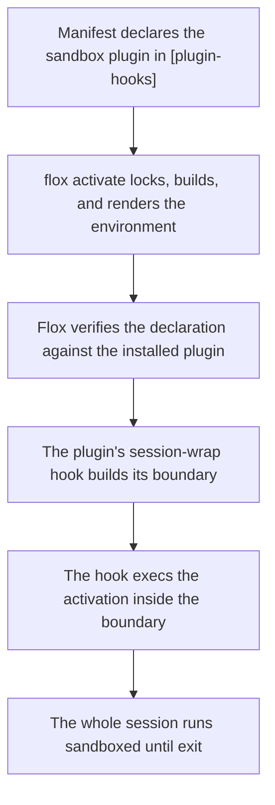

A growing share of what runs inside a developer environment isn't typed
by a developer: coding agents, build tools, and scripts pulled from the
ecosystem all execute with your full privileges. By default an activated
environment can read `~/.ssh`, your browser profiles, and your cloud
credentials, and can talk to any host on the network.

**Sandboxing** runs the activated session inside a boundary that limits
what it can touch. In Flox, sandboxing is not a CLI feature — it is a
[plugin](/concepts/plugins) built on the plugin framework's
[`session-wrap` hook](/concepts/plugins#session-wrap). Flox core provides
one generic extension point (wrap the session); a sandbox is an ordinary
installable package that uses it. The same pattern as
[secrets management](/concepts/secrets-management) — a class of problem
solved by a class of plugin — applied to isolation. The first such
plugin is [OpenShell](#openshell).

<Warning>
  Sandboxing is a **prototype**. It requires a development build of Flox
  from the flox/flox branch
  [`daniel/session-wrap-hook`](https://github.com/flox/flox/tree/daniel/session-wrap-hook),
  a manifest `schema-version` of `"1.16.0"`, and the
  `features.plugin_hooks` flag enabled
  (`flox config --set features.plugin_hooks true`). The OpenShell plugin
  is not yet published to the Flox Catalog — it is built from the
  flox-plugins branch
  [`daniel/openshell-plugin`](https://github.com/flox/flox-plugins/tree/daniel/openshell-plugin)
  and installed by store path. Expect the details below to change.
</Warning>

## The sandboxed activation pattern



The pattern has three phases:

### 1. Declare (in the manifest)

The environment's author installs the sandbox plugin (by store path,
while the package is unpublished — see the warning above) and declares
it in the typed, top-level `[plugin-hooks]` section, with the policy the
plugin supports in its own `[plugins.<name>]` table:

```toml
[plugin-hooks]
session-wrap = "plugin-openshell"

[[plugins.plugin-openshell.network]]
endpoint = "api.github.com:443"
access = "read-only"
binary = "curl"
```

The manifest carries the *policy* — which plugin wraps the session, what
the session may reach — versioned with the project like any other
manifest content. Policy edits take effect on the next activation.

### 2. Consent (at activation)

Handing a terminal session to third-party code is gated on the
environment's own author and on the person activating:

- Only the top-level manifest's `[plugin-hooks]` declaration counts — a
  declaration arriving through [composition](/concepts/composition) is
  dropped with a notice naming the include, so an included environment
  can never wrap your session.
- [Auto-activation](/concepts/auto-activation) prompts before entering a
  wrapping environment, defaulting to No.
- With the feature flag off, the declaration is ignored with a warning
  and activation proceeds unwrapped — teammates who haven't opted in
  aren't locked out of a shared environment.

### 3. Enforce (for the session's lifetime)

The hook execs the entire activation under its boundary and never
returns: there is no "decline the sandbox and continue unwrapped" path.
Every process in the session — your shell, its children, anything an
agent spawns — lives inside the boundary until the session exits. A
hook that can't build its boundary exits non-zero instead, and the
activation fails with it.

## Key security properties

- **Policy in the manifest, values nowhere** — the manifest declares
  *what may be reached*, reviewable in a PR like any other change
- **Consent is structural** — declarations are typed, top-level, and
  never inherited through includes; auto-activation asks first and
  defaults to No
- **One wrapper per environment** — the schema makes a second
  `session-wrap` declaration unrepresentable
- **Declaration is bound to the package** — the hook file must be
  shipped by the declared plugin's own locked package; a look-alike
  package shadowing a plugin's name is an activation error
- **Fail closed** — a wrapping environment activates wrapped or not at
  all; a sandbox plugin that can't build its boundary exits non-zero,
  failing the activation rather than silently degrading
- **No sandbox code in Flox core** — the backend is a package you can
  read, pin, replace, or write yourself

## OpenShell

`plugin-openshell` runs the session inside an
[NVIDIA OpenShell](https://github.com/NVIDIA/OpenShell) sandbox with
**deny-by-default network egress**, enforced at layer 7. At activation,
its `session-wrap` hook:

1. bakes the environment into a Docker image with `flox containerize`;
2. layers OpenShell's guest requirements on top — the `sandbox` user,
   writable home and runtime directories, `/bin/sh`, and trusted `ip`
   and `nsenter` binaries from a tools environment bundled in the
   plugin package;
3. compiles the manifest's `[[plugins.plugin-openshell.network]]` grants
   into an OpenShell policy;
4. execs `openshell sandbox create`, which runs the image's entrypoint
   — the environment's own activation — under OpenShell's supervisor.

The session runs as the unprivileged `sandbox` user with only the
project directory bind-mounted, read-write, at its host path. The rest
of the host filesystem, your home directory included, does not exist
inside the boundary, and no network endpoint is reachable unless the
manifest grants it. The sandbox deletes itself when the session exits.

### Requirements

- The OpenShell CLI, 0.0.62 or later, on `PATH` (validated against
  0.0.82)
- Docker — the CLI and a running daemon
- A reachable OpenShell gateway (`openshell status` must succeed) using
  the Docker compute driver with `enable_bind_mounts = true`

The hook checks each of these before doing anything else and fails the
activation with a pointer at the missing piece.

### Installing and configuring the plugin

Build the package from the `openshell` directory of the flox-plugins
checkout, then install it into the environment by store path, keeping
the default install ID `plugin-openshell`:

```console
$ flox build plugin-openshell
$ cd /path/to/project
$ flox install /nix/store/...-plugin-openshell-0.1.0
```

Then declare the wrapper and its policy:

```toml
[plugin-hooks]
session-wrap = "plugin-openshell"

[plugins.plugin-openshell]
autobake = true        # bake without prompting (default: prompt on a tty, fail otherwise)
# allow-stale = true   # run an existing image after env changes instead of rebaking
# image = "ref:tag"    # use this image verbatim; disables baking

[[plugins.plugin-openshell.network]]
endpoint = "api.github.com:443"   # required, <HOST>:<PORT>
access = "read-only"              # read-only | read-write | full (default: full)
protocol = "rest"                 # rest | websocket | graphql | mcp | json-rpc (default: rest)
binary = "curl"                   # install ID[/exe] or absolute guest path
```

No `[[plugins.plugin-openshell.network]]` entries means no egress at
all. Grants are scoped per endpoint, access mode, protocol, and
requesting binary. `binary` names a package in `[install]`, resolved
through the lockfile to its store path for the guest system (or an
absolute path inside the guest). In practice every rule needs one:
OpenShell 0.0.8x runs its policy engine in binary-identity mode, and
endpoint grants without a `binary` are denied.

Each `[plugins.plugin-openshell]` setting has an environment-variable
override for CI: `FLOX_PLUGIN_OPENSHELL_AUTOBAKE`,
`FLOX_PLUGIN_OPENSHELL_ALLOW_STALE`, and `FLOX_PLUGIN_OPENSHELL_IMAGE`.

### Images and caching

The image is tagged with a digest of the lockfile with the plugin's own
footprint stripped — its `[plugin-hooks]` declaration, its
`[plugins.plugin-openshell]` table, and its `[install]` entry — so
policy edits and plugin upgrades never invalidate the image; only real
environment changes do. The compiled policy is written to
`.flox/cache/plugins/plugin-openshell/openshell-policy.yaml` on every
activation and handed to OpenShell at launch, which is why network
grants apply on the next activation without a rebake.

When no image exists for the current digest, the hook prompts to bake
on a terminal and fails otherwise; `autobake = true` bakes without
asking, and `allow-stale = true` runs an existing image from a previous
digest instead. The images are the cache: after a rebake the plugin
removes superseded `<env>-openshell` tags (keeping the current digest
and `latest`), and the base `flox containerize` images are never
removed.

### Limitations

- **No `flox` CLI inside the guest.** The session runs the environment's
  activation, but `flox` commands and `[services]` are unavailable
  in-session.
- **Host environment variables are not forwarded.** The guest sees the
  image's baked configuration, not your shell's variables.
- **In-place activation is refused.** `eval "$(flox activate)"` cannot
  be wrapped, as with any session wrapper.
- **Other store-path installs fail the bake.** A host-only store path in
  `[install]` — other than the plugin itself, which is stripped — cannot
  be realized for the guest.
- **Backslashes in `-- <cmd>` arguments are stripped** somewhere in
  OpenShell's `sandbox create … -- <cmd>` transport (observed with
  0.0.82: `curl -w '%{http_code}\n'` arrives as `%{http_code}n`). Avoid
  backslash escapes in `flox activate -- <cmd>` arguments; a quoted
  `bash -c` string is unaffected in practice for common cases.
- **Validated on macOS only**, with a local gateway. The Linux host leg
  has not been exercised.

## Writing your own session boundary

There is nothing privileged about the OpenShell plugin — it is a
directory in [flox-plugins](https://github.com/flox/flox-plugins)
containing a Flox build environment, one executable at
`etc/flox/hooks/session-wrap.d/plugin-openshell`, a small pre-locked
tools environment the guest image needs, and a README. A new
backend is a new package: implement the
[`session-wrap` contract](/concepts/plugins#session-wrap) — read the
context file, build your boundary, exec the activation inside it — and
test it with a store-path install, no publishing required. See
[Lifecycle hooks](/concepts/plugins#lifecycle-hooks) for the full
protocol.

## Further reading

- [Plugins](/concepts/plugins) — the framework sandbox plugins are built
  on, including the `session-wrap` contract
- [flox-plugins repository](https://github.com/flox/flox-plugins) — the
  OpenShell plugin package and its README
- [Secrets management](/concepts/secrets-management) — the same
  plugin-class pattern applied to secrets
- [Flox vs. containers](/concepts/flox-vs-containers) — where
  container-based isolation fits relative to Flox environments
- [Activating environments](/concepts/activation) — the activation
  timeline the hook extends
