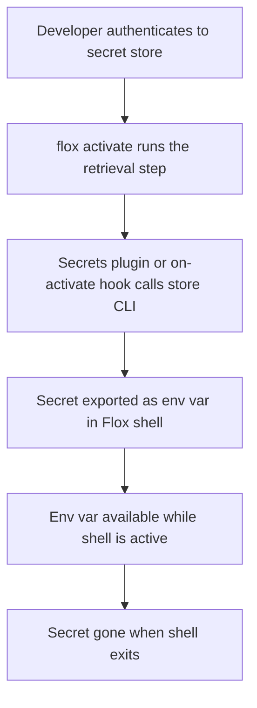

A common need is to authenticate a Flox environment to external
services—for example, a GitHub account or a database password inside a
project environment.

Secrets should never be hardcoded in a `manifest.toml` file.
Hard-coded secrets could end up committed to git, visible in shell history,
and cannot be rotated without editing the manifest.
Dotenv files have similar issues.

A secure pattern is to keep secrets in a secret store and retrieve them
just-in-time during `flox activate`,
exporting them as environment variables that live only while the
environment is active.

## The JIT secrets pattern



The pattern has three phases:

### 1. Primary auth (once per session)

A human authenticates once to a secret store using a primary credential
(biometric, SSO session, password, etc.).
This grants a session or token that the retrieval step will use.
This is the human-in-the-loop gate—it makes secret access auditable
and revocable.

### 2. Secret retrieval (plugin or hook)

Two mechanisms retrieve secrets at shell activation time:

- **Secrets plugins** (flox 1.14.0 or later) — install a plugin package
  for your secret store and declare which secrets you need in a
  `[plugins.<name>]` table in `manifest.toml`.
  The plugin bundles the store's CLI together with the retrieval script,
  so one package delivers both.
- **`on-activate` hook** — for stores without a plugin, call the store's
  CLI yourself from the `on-activate` hook in `.flox/env/manifest.toml`.

Either way the store validates the active session before returning
values, and the manifest carries only *references* to where secrets
live—never the values themselves.

See [Activating environments](/concepts/activation) for more about hooks.

### 3. Scoped env var injection

Retrieved secrets are exported as environment variables.
They exist only in the active Flox shell and are gone when the shell
exits.
They are never written to the project directory, the manifest, or git.

## Key security properties

- **Not in manifest** — secret values are never written to `manifest.toml`
- **Not committed to git** — the manifest is safe to commit; it contains
  only retrieval instructions, not values
- **Not in dotenv files** — no `.env` file to accidentally expose
- **Not in shell history** — retrieval runs non-interactively during
  activation
- **Auditable** — the secret store logs each access
- **Rotatable** — update the value in the store; the manifest never changes
- **Scoped** — credentials are per-environment, not global

## Secrets plugins

A secrets plugin is an ordinary package that ships the store's CLI plus
a script Flox runs during activation (dev and build modes—in build mode
the sandboxed script skips network lookups, and run-mode activations
don't source plugin scripts at all).
The script reads this plugin's `[plugins.<name>]` table from the
manifest and exports one environment variable per string-valued entry.

Plugins exist for 1Password, HashiCorp Vault, OpenBao, and Infisical.
The packages are published to the `flox` org on FloxHub, making
installation a single command:

```console
$ flox install flox/plugin-vault
```

<Note>
  The `[plugins]` manifest section requires flox 1.14.0 or later.
  A reference that fails to resolve (missing secret, expired session)
  prints a warning and leaves that variable unset—activation still
  succeeds, and any error output from the store CLI passes through so
  you can act on it.
</Note>

## Implementation examples

<Tabs>
  <Tab title="1Password">

  Install the `flox/plugin-1password` package, then declare the secrets the
  environment needs:

  ```toml
  [plugins.1password]
  GH_TOKEN = "op://Personal/GitHub Work Token/credential"
  ```

  References are 1Password secret references (`vault/item/field`, with
  or without the `op://` prefix).

  Requires an active `op` session: `op signin`, the
  [desktop-app integration](https://developer.1password.com/docs/cli/app-integration/)
  with biometric approval, or `OP_SERVICE_ACCOUNT_TOKEN` in
  non-interactive contexts (CI, servers).

  See the [Flox + 1Password blog post](https://flox.dev/popular-packages/adding-1password-secrets-to-flox-environments/)
  for a hook-based walkthrough of the same store.
  </Tab>
  <Tab title="HashiCorp Vault">

  Install the `flox/plugin-vault` package, then declare the secrets the
  environment needs:

  ```toml
  [plugins.vault]
  GH_TOKEN = "secret/github-work#token"
  ```

  Everything before the last `#` is the KV path, mount included; the
  part after it is the field to extract.
  Both KV v1 and v2 mounts work—`vault kv get` detects the mount
  version and inserts the v2 `data/` path segment itself.

  Requires `VAULT_ADDR` and a token, exactly as the `vault` CLI
  resolves them: `VAULT_TOKEN`, or `~/.vault-token` written by
  `vault login` (OIDC, LDAP, token, etc.).
  </Tab>
  <Tab title="OpenBao">

  Install the `flox/plugin-openbao` package, then declare the secrets the
  environment needs:

  ```toml
  [plugins.openbao]
  GH_TOKEN = "secret/github-work#token"
  ```

  References work exactly as in the Vault plugin: KV path before the
  last `#`, field after it, KV v1 and v2 both supported.

  Requires `BAO_ADDR` and a token, exactly as the `bao` CLI resolves
  them: `BAO_TOKEN`, or the token helper file written by `bao login`.
  </Tab>
  <Tab title="Infisical">

  Install the `flox/plugin-infisical` package, then declare the secrets the
  environment needs:

  ```toml
  [plugins.infisical]
  DB_PASSWORD = "dev/DB_PASSWORD"
  STRIPE_KEY = "prod/backend/payments/STRIPE_KEY"
  ```

  The first segment is the Infisical environment slug (`dev`,
  `staging`, `prod`, …), the last is the secret name, and anything
  between is the folder path (defaults to `/`).

  Select the project by running `infisical init` once in the project
  directory, or by setting `INFISICAL_PROJECT_ID` (a plugin
  convention, forwarded to the CLI as `--projectId`; required with
  machine-identity auth).
  Authenticate interactively with `infisical login`, or set
  `INFISICAL_TOKEN` in non-interactive contexts.
  Self-hosted deployments also set `INFISICAL_API_URL`.

  The Infisical CLI prints nothing for a missing secret, so the
  plugin's own warning is what you'll see; a secret whose value is
  genuinely empty is indistinguishable from a missing one and is also
  left unset.
  </Tab>
  <Tab title="macOS Keychain">

  No plugin yet—use an `on-activate` hook.

  Store the token once:

  ```bash
  security add-generic-password -a "$USER" -s "github-work-token" -w "ghp_yourtoken"
  ```

  Retrieve in `on-activate`:

  ```toml
  [hook]
  on-activate = '''
    export GH_TOKEN=$(security find-generic-password -a "$USER" -s "github-work-token" -w)
  '''
  ```

  <Note>
    macOS shows a Keychain access dialog on first use.
    Clicking **Always Allow** makes subsequent activations silent.
    In non-interactive contexts (CI, SSH without a GUI agent) the dialog
    cannot appear and the command will fail—use a CI-native secret
    mechanism instead.
  </Note>
  <Note>
    `security` is installed by default at `/usr/bin/security` on all macOS
    versions. No Xcode or Homebrew required.
  </Note>
  </Tab>
  <Tab title="AWS Secrets Manager">

  No plugin yet—use an `on-activate` hook.

  ```toml
  [hook]
  on-activate = '''
    export GH_TOKEN=$(aws secretsmanager get-secret-value \
      --secret-id github-work-token \
      --query SecretString \
      --output text)
  '''
  ```

  Requires the `aws` CLI and an active `aws sso login` session.
  `flox install awscli2` to add the CLI to your environment.
  </Tab>
  <Tab title="Cross-platform (macOS + Linux)">

  Cross-platform secret stores work the same on macOS and Linux—no
  conditional needed.
  That includes every store with a secrets plugin (1Password, Vault,
  OpenBao, Infisical) as well as hook-based stores like AWS Secrets
  Manager.
  The plugin packages follow their store CLI's system availability—
  `flox show` lists the systems a package supports.

  A conditional is only necessary when different tools are used on each
  platform, such as macOS Keychain on macOS and `pass` on Linux:

  ```toml
  [hook]
  on-activate = '''
    if [[ "$OSTYPE" == "darwin"* ]]; then
      export GH_TOKEN=$(security find-generic-password -a "$USER" -s "github-work-token" -w)
    else
      export GH_TOKEN=$(pass show github/work-token)
    fi
  '''
  ```

  The Linux side of this example uses [`pass`](https://www.passwordstore.org/),
  which stores secrets in GPG-encrypted files.
  `flox install pass`, `flox install pinentry-tty`, and `flox install gnupg`
  to add the required packages to your environment.
  </Tab>
</Tabs>
## Rotating a secret

Because the value lives in the store, not the manifest, rotation requires
no manifest changes:

1. Generate a new secret at the issuer.
2. Update the secret store.

The next `flox activate` automatically uses the new value.
No PR, no teammate notification, no dotenv sync required.

<Warning>
  If a Flox shell is already active when rotation happens, the old value
  remains set in that running shell.
  The new value takes effect on the next fresh `flox activate`
  (re-attaching to a still-cached activation replays the previously
  fetched values).
  If rotation is in response to a credential compromise, kill active
  shells explicitly.
</Warning>
Finally, revoke the old token at the issuer once no more environments are
active with the old secret value.

## Secret store reference

| Store | Flox plugin | Primary auth | Retrieval command |
| --- | --- | --- | --- |
| macOS Keychain | — | Login session / biometric | `security find-generic-password -a "$USER" -s "name" -w` |
| Linux keyring | — | Desktop session | `secret-tool lookup service name account user` |
| 1Password | `flox/plugin-1password` | `op signin` / biometric | `op read op://vault/item/field` |
| HashiCorp Vault | `flox/plugin-vault` | `vault login` (OIDC/LDAP/token) | `vault kv get -field=value secret/path` |
| OpenBao | `flox/plugin-openbao` | `bao login` (OIDC/LDAP/token) | `bao kv get -field=value secret/path` |
| Infisical | `flox/plugin-infisical` | `infisical login` | `infisical secrets get NAME --env=dev --plain` |
| AWS Secrets Manager | — | `aws sso login` | `aws secretsmanager get-secret-value --secret-id name --query SecretString --output text` |
| Doppler | — | `doppler login` | `doppler secrets get NAME --plain` |
| Pass | — | GPG key unlock | `pass show service/credential` |

## Packaging this pattern as a plugin

Writing the same `on-activate` retrieval hook into every environment that
needs a given secret store gets repetitive. [Plugins](/concepts/plugins)
let you package that hook once, as an installable component that other
environments configure through a `[plugins]` table instead of copying
shell code.

## Further reading

- [flox-plugins repository](https://github.com/flox/flox-plugins) —
  the secrets plugin packages and per-plugin READMEs
- [Cross-platform secrets blog post](https://flox.dev/blog/get-your-preferred-secrets-manager-in-a-portable-cross-platform-cli-toolkit/)
- [Flox and AWS secrets management](https://flox.dev/blog/flox-and-aws-taking-the-chaos-out-of-secrets-management/)
- [Flox + 1Password](https://flox.dev/popular-packages/adding-1password-secrets-to-flox-environments/)
- [`manifest.toml` reference](/man/manifest.toml) — `[hook]` section
- [Activating environments](/concepts/activation) — how hooks work
- [Plugins](/concepts/plugins) — package this pattern as an installable
  component
