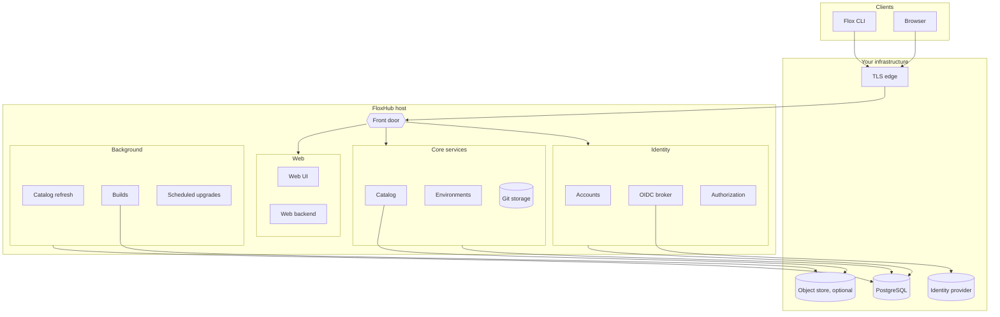

A reference architecture is a layout Flox builds, tests, and supports. It tells
you which components run where, which pieces you supply, and what the
arrangement does and does not give you.

**One topology is documented today: a single host.** Every component runs on one
machine, with your database and your TLS edge beside it.

<Card title="Single-host deployment" icon="server" href="/floxhub-onprem/reference-architectures/single-host">
  The component topology, network boundaries, persistent state, and operator
  responsibilities in detail.
</Card>

## The shape of a deployment

## What runs on the host

| Component | Responsibility |
| --- | --- |
| Front door | Terminates every client request, authenticates it, and routes it |
| Web UI and backend | The browser interface and the session it runs in |
| Catalog | Resolving and serving packages |
| Environments | Storing environments and their generations |
| Git storage | Backing `flox push` and `flox pull` |
| Accounts | Users, organizations, and tokens |
| OIDC broker | Translating your identity provider into one interface |
| Authorization | Deciding what each identity may reach |
| Catalog refresh | Populating the catalog and keeping it current |
| Builds | Building and publishing packages inside the deployment |
| Scheduled upgrades | Advancing managed environments on a cadence |

Every component that can be switched off is switched off by configuration
rather than by editing the environment. A component whose gate is off idles, so
turning one on or off is a setting change and a restart.

## What you supply

| Piece | Why it is yours |
| --- | --- |
| The host | Provisioning, sizing, and OS patching |
| PostgreSQL | The deployment ships no database; this is its durable state |
| The TLS edge | The front door speaks plain HTTP and holds no certificate |
| An identity provider | The deployment holds no passwords |
| An object store | Optional, and only for carrying published binaries |

See [Installation requirements](/floxhub-onprem/install/requirements) for the
prerequisites each of these has to meet.

## Choosing an architecture

With one documented topology, the question is not which to pick but whether
single-host meets your needs. It does when:

- One host can carry your users and your catalog.
- Planned downtime for upgrades is acceptable. An upgrade stops services.
- Your availability requirement is met by your own host and database recovery
  rather than by redundancy inside FloxHub.

It does not give you high availability. There is no second host to fail over
to, and no component runs redundantly. Availability comes from the resilience
of the host and the database you supply, plus your ability to restore from
backup — so
[Back up and restore](/floxhub-onprem/administration/maintain/backup-restore)
matters more here than it would in a redundant deployment.

<Note>
  Separating components across hosts, running any of them redundantly, or
  pointing the deployment at managed equivalents of its bundled pieces are not
  documented or supported arrangements today. The single-host topology is what
  Flox tests and supports.
</Note>

## Sizing

How much host to provision for a given number of users and catalog size is
being measured, and will be published alongside the single-host topology once
those figures exist. Until then, treat capacity as something to validate in
your own environment rather than something this page can answer.
